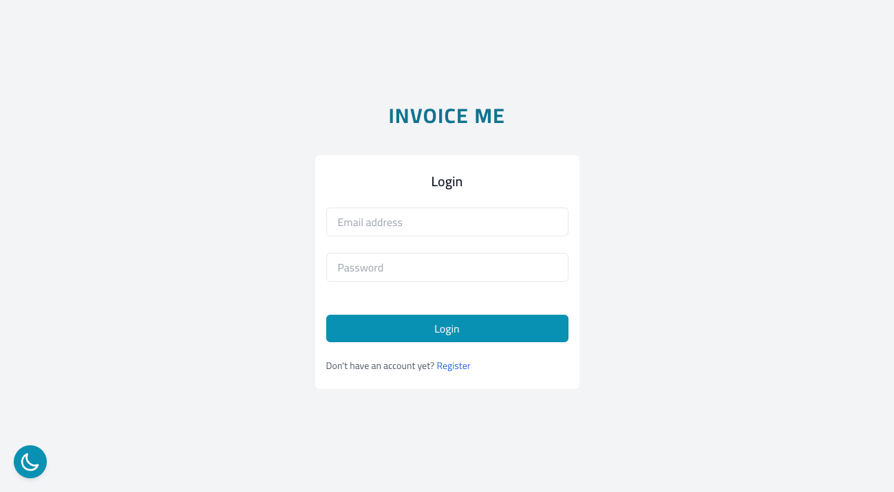

# Invoice Me

## License
   [](https://opensource.org/licenses/MIT)

   Please click on the badge to view license info.

---

## Description
Invoice Me is an application that will allow the user to send payment reminders and invoices to their clients.

---

## Table of Contents

- [License](#license)
- [Description](#description)
- [Installation](#installation)
- [Usage](#usage)
- [Visuals](#visuals)
- [Tests](#tests)
- [User Story](#user-story)
- [Status](#status)
- [Technologies Used](#technologies-used)
- [Creators](#creators)

---

## Installation
In order to view this project, please visit the deployed link under the Usage section below.

---

## Usage

Please use Heroku link to view deployed app and Github to view the code.

Deployed Link: https://invoicemeteam.herokuapp.com

GitHub Repo: https://github.com/ssbbgm/invoice-me

---

## Visuals



---

## Tests

None.

---

## User Story

As a user, I want the abitlity to create and organize client profiles in which I can generate and track invoices, payments and payments owed by respective clients. 

``` GIVEN the home page of the application
WHEN I view the page, I’m given the option to login in, reset password, or register
IF I click Register
THEN I am taken to create an account
IF I click Reset Password
THEN I am sent an email to reset my password
WHEN I Login
THEN I am taken to my dashboard to see my clients and earnings
WHEN I click on Client List
THEN I can see a list of my clients and can remove and add or go to a single client page
WHEN I click Remove 
THEN the client is remover
WHEN I click Edit
THEN the client can be edited
WHEN I click on Generate Invoice
THEN I can see an invoice generated and it will be emailed to the client
WHEN I scroll down on the generated invoice
THEN I am presented with detailed information pertaining to client services
WHEN I click on the User picture
THEN I can log out of the system
```
---

## Status

Currently the user is able to login. Once logged in they are granted access to the invoice tab as well as the ability to generate a detailed invoice with email integration.

While certain functions of the app are currently in the testing phase, the following will give insight to the future functionality of Invoice Me:

* User will be able to create a personal profile page as well as pages for their individual clients
* User will be able to reset password
* User will be able to send payment requests to their clients
* The user's clients will then have the opportunity to send payments through a link in the invoice
* User will be able to send payment/overdue payment notices to their clients.

---

## Technologies Used

 * Node
 * Handlebars
 * MySQL
 * PDFKit
 * Nodemailer
 * Tailwind CSS

---
## Creators

* Lauren Anderson
* Sherreka Burton
* Molly Gove
* Mikhail Sookwah


